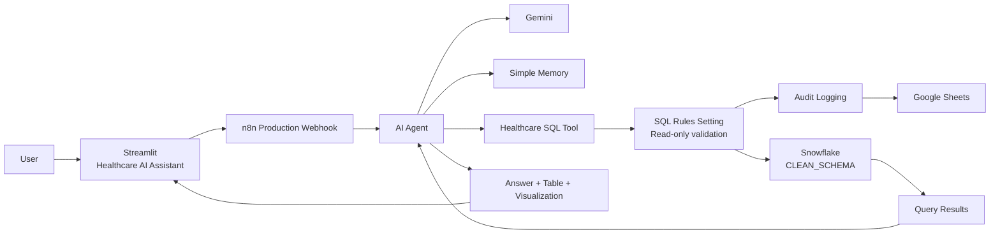

# 🏥 AI Healthcare Analytics Assistant

> **Agentic AI for conversational, governed healthcare analytics**

An end-to-end healthcare analytics application that lets users ask business questions in natural language and receive data-driven answers, structured tables, and visual insights.

The solution combines **Streamlit** for the user interface, **n8n** for agentic orchestration, **Google Gemini** for natural-language reasoning and SQL generation, **Simple Memory** for conversational context, **Snowflake** for curated healthcare analytics, and a backend **Google Sheets audit log**.

---

## 🚀 What This Project Does

Instead of requiring users to write SQL, the assistant turns questions such as:

- **How many providers are there?**
- **What is the total claim amount by specialty?**
- **Show the top 3 payers by total claim amount.**
- **Which payer has the highest covered encounters?**
- **Compare claim amount and payer coverage by specialty.**

into governed analytical workflows.

The application can:

✅ Understand natural-language healthcare questions  
✅ Generate analytical SQL through an AI agent  
✅ Use conversational memory for follow-up questions  
✅ Validate queries before database execution  
✅ Execute read-only analytics against Snowflake  
✅ Return business-friendly explanations and tables  
✅ Generate charts for suitable comparison/ranking questions  
✅ Handle out-of-scope and backend errors gracefully  
✅ Maintain backend query/audit logging

---

# 🧠 Solution Architecture



### Core flow

**User Question → Streamlit → n8n Webhook → AI Agent → Gemini / Memory / SQL Tool → SQL Validation → Snowflake → Results → AI Response → Streamlit**

---

# 🏗️ Technology Stack

| Technology | Role |
|---|---|
| **Streamlit** | Conversational frontend and visualization layer |
| **n8n** | Agentic workflow orchestration and webhook/API layer |
| **Google Gemini** | Natural-language reasoning and SQL generation |
| **Simple Memory** | Session-based conversational context |
| **Snowflake** | Curated healthcare data warehouse and analytical execution |
| **Python** | Application, API, response and visualization logic |
| **Pandas** | Tabular result handling |
| **Plotly** | Dynamic analytical charts |
| **Google Sheets** | Backend audit/query logging |

---

# 🩺 Healthcare Data Domain

The AI assistant is designed around the curated:

`HEALTHCARE_DB.CLEAN_SCHEMA`

The analytics layer contains seven healthcare entities:

- **PATIENTS**
- **PROVIDERS**
- **ORGANIZATIONS**
- **PAYERS**
- **ENCOUNTERS**
- **PROCEDURES**
- **CONDITIONS**

`ENCOUNTERS` acts as the central operational transaction table, with approved relationships connecting patients, providers, organizations, payers, procedures, and conditions.

---

# 🤖 Agentic Workflow

## 1. Natural-Language Request

The user enters a healthcare analytics question in Streamlit.

## 2. AI Reasoning

The n8n AI Agent uses Gemini to understand the business question and determine the required analysis.

## 3. Conversational Memory

Simple Memory provides recent conversation context so follow-up questions can reference previous interactions.

## 4. SQL Tool Invocation

When the question requires database analysis, the AI Agent invokes the dedicated Healthcare SQL Tool.

## 5. SQL Governance

The SQL workflow validates the generated query before execution.

The validation layer is designed to:

- Allow only `SELECT` / `WITH` queries
- Reject write or DDL operations
- Restrict access to the curated healthcare schema
- Prevent unsupported database operations

## 6. Snowflake Execution

Validated analytical SQL is executed against the curated Snowflake healthcare database.

## 7. Insight Delivery

The assistant returns:

- Natural-language explanations
- Structured result tables
- Visualizations for suitable comparative/ranking questions
- Response metadata such as execution time and data source

---

# 🔐 Data Governance & Guardrails

This project is designed as a **controlled analytics assistant**, not a general-purpose database agent.

### Read-Only SQL

The SQL validation layer rejects operations such as:

`INSERT`, `UPDATE`, `DELETE`, `DROP`, `ALTER`, `TRUNCATE`, `MERGE`, `CREATE`, `GRANT`, `REVOKE`, `CALL`, `EXEC`, and `EXECUTE`.

### Curated Schema Restriction

Queries are required to use the curated healthcare schema:

`HEALTHCARE_DB.CLEAN_SCHEMA`

### Sensitive Data Protection

The AI instructions explicitly prohibit exposing sensitive identifiers such as:

- `SSN`
- `DL_NUMBER`
- `PASSPORT_NUMBER`

### Domain Guardrails

Questions that cannot be answered using the healthcare schema are handled as out-of-scope instead of being reinterpreted into unrelated healthcare concepts.

---

# 📊 Analytics Capabilities

### Provider Analytics

- Provider volume
- Specialty analysis
- Encounter workload
- Provider comparisons

### Encounter Analytics

- Encounter volume
- Encounter types
- Claim amounts
- Payer coverage
- Average encounter metrics

### Payer Analytics

- Payer rankings
- Covered encounters
- Coverage and claim comparisons
- Payer contribution analysis

### Financial Analytics

- Total claim amount
- Claim amount by specialty
- Claim amount by payer
- Average claim metrics

### Comparative Analytics

The interface can present suitable ranking/comparison questions with structured tables and charts.

---

# 💬 Example Conversations

### Basic question

**User:**  
> How many providers are there?

**Assistant:**  
Returns the provider count from Snowflake with a concise business response.

### Analytical question

**User:**  
> What is the total claim amount by specialty?

**Assistant:**  
Returns the grouped analytical result and business interpretation.

### Ranking question

**User:**  
> Show the top 3 payers by total claim amount.

**Assistant:**  
Returns the ranked payer analysis and can present a visualization where appropriate.

### Follow-up question

The architecture supports session-based conversational memory so users can ask follow-up questions without repeating the complete context.

### Out-of-scope question

Questions outside the healthcare dataset are handled with a controlled response rather than fabricated data.

---

# 🖥️ Streamlit Application

The Streamlit interface includes:

- Dark healthcare-themed UI
- Conversational chat experience
- Suggested questions
- Result tables
- Dynamic comparison charts
- Response-time and source metadata
- Friendly backend error messages
- Optional technical details
- Session-based conversation identifier

The application sends the user question and session identifier to the n8n webhook.

---

# 📁 Repository Structure

```text
AI-Healthcare-Analytics-Assistant/
│
├── app.py
├── requirements.txt
├── README.md
├── .gitignore
│
├── n8n/
│   ├── AI_Healthcare_Analyst.json
│   ├── Healthcare_SQL_Tool.json
│   └── README.md
│
├── SQL/
│   ├── <Snowflake setup scripts>
│   ├── <raw table scripts>
│   ├── <cleaning scripts>
│   └── <analytics scripts>
│
└── PPT/
    └── <project presentation>
```

---

# ⚙️ Local Setup

## 1. Clone the repository

```bash
git clone https://github.com/<your-username>/AI-Healthcare-Analytics-Assistant.git
cd AI-Healthcare-Analytics-Assistant
```

## 2. Install dependencies

```bash
pip install -r requirements.txt
```

The current application dependencies are:

- Streamlit
- Requests
- Pandas
- Plotly

## 3. Start n8n

Run your local n8n instance and make sure the production webhook is active.

## 4. Start Streamlit

```bash
streamlit run app.py
```

Then open:

```text
http://localhost:8501
```

### Webhook configuration

The application supports the environment variable:

```text
N8N_WEBHOOK_URL
```

Example:

```bash
set N8N_WEBHOOK_URL=http://localhost:5678/webhook/healthcare-ai
```

For hosted deployments, replace the local webhook with the publicly reachable n8n endpoint.

---

# 🌐 Deployment

The intended deployment pattern is:

```text
GitHub
   ↓
Streamlit Community Cloud
   ↓
Public Streamlit URL
   ↓
Public n8n Webhook
   ↓
Gemini
   ↓
Healthcare SQL Tool
   ↓
Snowflake
```

> **Important:** A cloud-hosted Streamlit application cannot directly call `localhost` on the developer's computer. The n8n webhook must therefore be publicly reachable for a fully public demo.

---

# 📸 Project Evidence

The presentation includes evidence of:

- Streamlit application UI
- n8n AI Agent workflow
- Conversational memory configuration
- Healthcare SQL Tool workflow
- Snowflake execution
- Analytical answers and visual insights
- Error handling and domain guardrails

---

# 🎯 Business Value

The solution demonstrates how agentic AI can make healthcare analytics more accessible without removing governance around database access.

### Key value areas

- Faster access to ad-hoc healthcare insights
- Lower dependency on manual SQL analysis
- Conversational self-service analytics
- Cross-entity healthcare analysis
- Governed read-only database access
- Business-friendly result presentation
- Reusable architecture for future analytical domains

---

# ⚠️ Disclaimer

This project uses a **synthetic healthcare analytics dataset** and is intended for portfolio, learning, and demonstration purposes.

It is **not a clinical decision-support system** and should not be used for patient diagnosis, treatment, or real-world medical decision making.

---

# 👤 Project

**AI Healthcare Analytics Assistant**

**Domain:** Healthcare Analytics  
**Architecture:** Agentic AI + Data Warehouse + Conversational Analytics  
**Core Stack:** Streamlit • n8n • Gemini • Snowflake

---

## ⭐ If you find this project useful

Feel free to explore the workflow, review the architecture, and use the project as a reference for building governed natural-language analytics applications.
